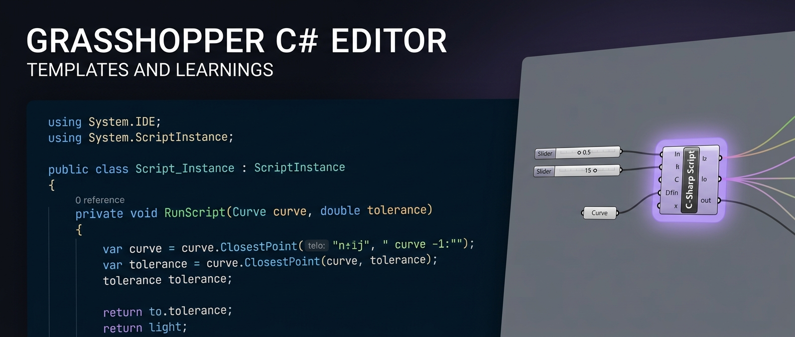

<div align="center">



# 🦗 Grasshopper C# Editor — Templates & Learnings

**Copy-paste C# templates and a ~2,700-line learnings doc for writing scripts in the Rhino 8 Grasshopper Script Editor — every rule that avoids the Roslyn-based environment's quirks, every pattern that survives across Rhino 7 and 8.**

[](./LICENSE)
[](https://www.rhino3d.com/)
[](https://dotnet.microsoft.com/)
[](#environment-notes)
[](#template-reference)

</div>

The Rhino 8 Script Editor *theoretically* supports modern C# 8+ via Roslyn. In practice, the runtime rejects half of it — pattern matching crashes the compiler, `out var` is forbidden, LINQ randomly fails type resolution, and a single umlaut anywhere in your code crashes the build silently. **This repo is the field guide that costs a year of confused debugging to assemble.** It collects every working pattern (geometry, DataTree, Galapagos, KUKAprc, real-time networking, motion-capture replay) and every rule that prevents the editor from biting you.

Three things ship in here:

1. **18+ copy-paste templates** in `templates/` — each one self-contained, with the full class wrapper, using statements, and a header comment listing expected inputs/outputs. Drop a C# Script component on the GH canvas, paste, adjust the input shapes, done.
2. **A 2,700-line learnings doc** (`grasshopper_csharp_learnings.md`) — 32 sections covering the script structure, critical rules, DataTree handling, Galapagos fitness skeletons, KUKAprc robot toolpaths, networking patterns (UDP/TCP), and `AppDomain` tricks for keeping sockets alive across solves.
3. **Project-specific scripts** in `projects/{project-name}/` — non-generic scripts written for a specific job (e.g. stone-panel miter angle calculator, surface unrolling pipeline). Useful as fully-worked examples; not meant to be reused verbatim.

> **The first rule of writing C# in Grasshopper:** read [`grasshopper_csharp_learnings.md`](./grasshopper_csharp_learnings.md) before writing anything. Or just paste a template from `templates/` and customize. Trying to write from scratch without checking the doc is how you spend a Tuesday afternoon staring at a meaningless `CS0019` error caused by a single em-dash in a comment.

---

## Contents

- [What's in here](#whats-in-here)
- [How to use the templates](#how-to-use-the-templates)
- [The learnings doc](#the-learnings-doc)
- [Template reference](#template-reference)
- [Environment notes](#environment-notes)
- [License](#license)
- [Sibling project](#sibling-project)

---

## What's in here

```
/
├── grasshopper_csharp_learnings.md        # The main reference doc — rules, patterns, recipes
├── templates/                             # Generic reusable templates (copy-paste starting points)
│   ├── kukaprc_toolpath.cs                # Robot toolpath generation for KUKAprc
│   ├── geometry_processing.cs             # Curve/surface/brep operations with null guards
│   ├── datatree_processing.cs             # DataTree read, transform, and output patterns
│   ├── galapagos_fitness.cs               # Galapagos optimization fitness function skeleton
│   ├── curve_dash_pattern_V1/V2.cs        # Parametric dash/gap patterns along curves
│   ├── panel_volume_generator_V3/V4.cs    # Panel extrusion to solid volumes
│   ├── surface_curvature_*.cs             # Curvature analysis, heatmap, mesh colouring (V1-V4)
│   ├── surface_flatten_*.cs               # Unroll/flatten with distortion and kink detection
│   └── surface_kink_*.cs                  # Kink curve detection and 3D extraction
└── projects/                              # Project-specific scripts (NOT generic templates)
    ├── stone-panel-fabrication/           # Geometric stone -> 19mm Spanplatten workflow
    │   ├── miter_angle_calculator.cs      # Dihedral + miter angles for shared edges
    │   └── panel_volume_generator_V3/V4.cs
    └── unroll-surfaces/                   # Surface unrolling pipeline scripts
```

**Convention:** Generic reusable scripts live in `templates/`. Scripts built for a specific project live in `projects/{project-name}/`. Don't mix them.

---

## How to use the templates

1. Open Grasshopper → add a **C# Script** component
2. Double-click to open the Script Editor
3. Copy the content of the relevant template file
4. Paste it in — the template includes the full class wrapper, using statements, and `RunScript` signature
5. Adjust inputs/outputs in the template header comment to match what you set up in GH

Each template has a header comment listing its expected inputs and outputs:

```csharp
// Template: KUKAprc Toolpath
// Inputs: toolpathCurve (Item), workPlane (Item), divisions (Item, int),
//         approachHeight (Item, 50), approachSpeed (Item, 200), workSpeed (Item, 100)
// Outputs: planes, speeds
```

---

## The learnings doc

`grasshopper_csharp_learnings.md` is the main reference — ~2,700 lines covering everything that's non-obvious or environment-specific about writing C# in Grasshopper.

### Key sections

**Script structure** — The exact class/method wrapper GH expects. Never write the class yourself; paste only the body.

**Critical rules — never break these:**

- No German or non-ASCII characters anywhere (comments, variable names, strings). The Rhino 8 C# compiler crashes on umlauts, em-dashes, arrows, or any non-ASCII symbol.
- No `out var` declarations — use explicit type declaration before the method call.
- No pattern matching (`is` expressions), records, switch expressions, or tuple deconstruction. Stick to classic C# 4/5 syntax.
- No LINQ — use explicit `for` loops. LINQ can cause type resolution issues in the script environment.

**Guard → Default → Work → Output pattern** — The standard structure for every script:

```csharp
// 1. Set output defaults (so downstream stays valid even if guards trigger)
out_result = new List<Point3d>();

// 2. Null/empty guards
if (curve == null) { AddRuntimeMessage(...); return; }

// 3. Input defaults (fallback values for optional inputs)
if (tolerance <= 0) tolerance = 0.01;

// 4. Do the actual work

// 5. Assign outputs
out_result = result;
```

**DataTree handling** — How to read `GH_Structure<T>`, iterate branches, and output back into a tree with matching path structure.

**Galapagos** — How to wire sliders directly as genome, output a single fitness number, protect against NaN/infinity, and use penalty values correctly.

**KUKAprc** — How to generate plane lists and speed lists for robot toolpath components.

**Common Rhino geometry patterns** — Curve division, closest point, intersection, offset, boolean operations — all with the explicit null checks and tolerance handling the environment requires.

**Networking & Real-Time patterns (patterns 50–58):**

- `AppDomain` as Rhino-wide shared memory — keeps sockets/threads alive across GH solves
- `EnsureGlobalListener` pattern — prevents port conflicts on re-evaluation (UDP + TCP)
- Momentary pulse via `Component.ExpireSolution(true)` — self-clearing event signals
- `this.Iteration > 0` guard — prevents ghost evaluations when DataTree inputs are used
- UR Robot TCP binary protocol (CB3/e-Series) — byte offsets for joint/TCP/IO data
- Camera/tracker coordinate flip — screen-space Y-down to Rhino Y-up mapping
- Plane serialization with `InvariantCulture` — locale-safe float read/write
- DataTree recording with Takes/Frames/Device hierarchy — motion capture replay structure
- Manual JSON with `StringBuilder` — no Newtonsoft available in GH scripting

---

## Template reference

### `kukaprc_toolpath.cs`

Generates robot approach and working planes along a curve for use with the KUKAprc Grasshopper plugin.

**What it does:**

- Divides input curve by count
- Creates a `Plane` at each division point (normal = curve tangent)
- Prepends an approach point at `approachHeight` above the curve start
- Outputs parallel `planes` and `speeds` lists — wire directly into KUKAprc Core

**Inputs:** `toolpathCurve`, `workPlane`, `divisions`, `approachHeight`, `approachSpeed`, `workSpeed`
**Outputs:** `planes` (List\<Plane\>), `speeds` (List\<double\>)

---

### `geometry_processing.cs`

Starting point for scripts that work with curves, surfaces, or Breps.

**What it does:**

- Accepts a curve and a list of points
- Finds the closest point on the curve for each input point
- Filters results by distance threshold
- Demonstrates: null guards, `ClosestPoint`, `DistanceTo`, list building

**Inputs:** `curve` (Item), `points` (List), `tolerance` (Item, default 0.01)
**Outputs:** `out_points`, `out_distances`, `out_count`

---

### `datatree_processing.cs`

Starting point for scripts that consume and produce DataTrees while preserving branch structure.

**What it does:**

- Reads an input DataTree (must be set to **Tree Access** mode — right-click the input)
- Iterates branches, applies a scalar factor to each number
- Outputs a new DataTree with identical branch paths
- Demonstrates: `GH_Structure<T>`, `DataTree<T>`, `GH_Path`, branch iteration

**Inputs:** `inputTree` (Tree access), `factor` (Item, default 1.0)
**Outputs:** `out_tree`, `out_counts`

> **Important:** The `inputTree` parameter must be set to **Tree Access** mode in GH (right-click the input → "Tree Access"). Item or List access will flatten the tree.

---

### `galapagos_fitness.cs`

Skeleton for a Galapagos evolutionary solver fitness function.

**What it does:**

- Takes numeric gene inputs (connect Number Sliders directly as genome)
- Computes a fitness value
- Protects against `NaN` and `Infinity` with a penalty value
- Outputs a single number — wire into Galapagos Fitness input

**Galapagos setup:**

1. **Genome:** Connect Number/Integer Sliders **directly** to script inputs (no intermediate components)
2. **Fitness:** Connect the single output to Galapagos Fitness
3. **Direction:** Set to "Minimize" if lower = better
4. **Penalty:** Uses `999999` not `double.MaxValue` (MaxValue causes overflow in Galapagos internals)

**Inputs:** `gene1`, `gene2`, `geneInt`
**Outputs:** `fitness` (single number)

---

## Environment notes

| Field | Value |
|-------|-------|
| Rhino version | 7 / 8 |
| Script engine | Rhino 8: Roslyn (C# 8+, but restricted subset) |
| Target framework | .NET Framework 4.8 |
| Safe C# version | C# 5 syntax subset (no pattern matching, no records, no LINQ) |
| Non-ASCII | Not supported — compiler crashes |

The Rhino 8 Script Editor uses Roslyn and theoretically supports modern C#, but the actual runtime environment in practice rejects many C# 7/8+ features. All templates stick to C# 4/5 syntax that works universally across Rhino 7 and 8.

---

## License

[MIT](./LICENSE) — fork the templates, copy them into your own learnings doc, build on top. If you find a new working pattern (or a new way the Rhino 8 script editor breaks), open an issue.

---

## Sibling project

Part of a small toolkit of Rhino/Grasshopper helpers:

- **[NC_Hops_Rhino_Plugin](https://github.com/Leonardboeker/NC_Hops_Rhino_Plugin)** (*Wallaby Hop*) — a full Grasshopper plugin that uses these same C# patterns at scale: parametric CNC operations, cabinet generation, OpenNest-based nesting, `.hop` file export for HOLZ-HER machines. Templates here teach you to write a C# Script; the plugin shows what a 60-component production toolkit built from those patterns looks like.
